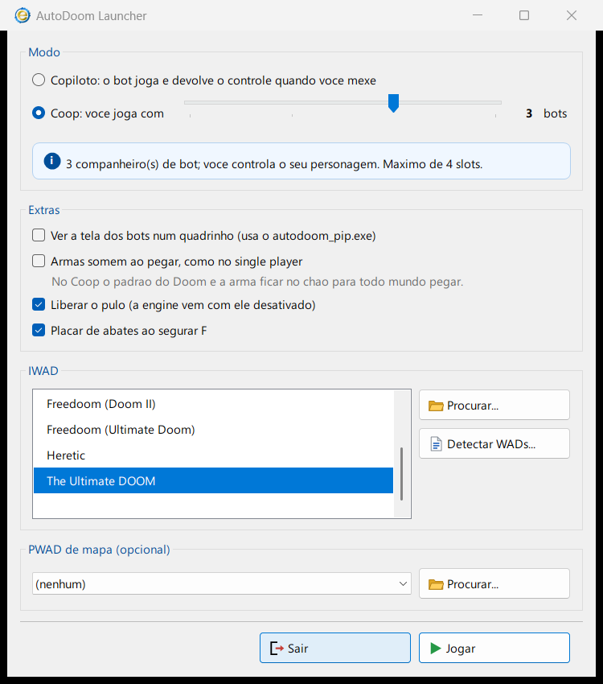

# AutoDoom PIP + Launcher

> Picture-in-picture and a friendly launcher for [AutoDoom](https://github.com/ioan-chera/AutoDoom),
> Ioan Chera's fork of the [Eternity Engine](https://github.com/team-eternity/eternity) with a
> pathfinding bot.

**[English](#english) · [Português](#português)**


---

## English

Watching a bot play is more fun when you can see what *it* sees. This adds a corner box with
another player's view, rendered in the same frame as your own, plus a launcher that ties the
loose ends of running AutoDoom together.

### What's in the box

| | |
| --- | --- |
| **`autodoom_pip.exe`** | AutoDoom built with picture-in-picture. Off by default. |
| **`AutoDoom Launcher.exe`** | Pick an IWAD, a map PWAD and a play mode. Finds WADs by reading the NTFS journal. |
| **`AutoDoomPip-Setup.exe`** | Installs both into an existing AutoDoom folder, with shortcuts and an uninstaller. |
| **`autodoom-pip.patch`** | The engine change, 215 added lines across five files. |

### Picture-in-picture

Enable it with `-pip` on the command line, with the `pip` cvar, or by ticking the box in the
launcher.

| cvar | what it does | default |
| --- | --- | --- |
| `pip` | turns the box on | `0` |
| `pip_size` | size of each box, in % of the screen | `25` |
| `pip_count` | how many boxes, laid out left to right | `1` |
| `pip_bottom` | `0` = top row, `1` = bottom row | `0` |

With a single box it follows **the player with the most kills**. Pressing **F12**
(`spectate_next`) takes the box over for ten seconds, then it goes back to the leader. While
PIP is on, that key only moves the box — your own view stays yours.

### The launcher



- **Copilot** — the bot plays your character and hands control back the moment you touch the
  keys, taking it again a second after you stop. This is stock AutoDoom behaviour; the launcher
  just knows which switch turns it on (there isn't one: it's the *absence* of `-bots`).
- **Coop** — you play alongside 1 to 4 bots. Four is the engine's ceiling (`MAXPLAYERS`), and at
  four your own character goes on autopilot too, because there is no free slot left.
- **Weapons disappear when picked up** — Doom's co-op default leaves weapons on the floor for
  everyone (`DM_WEAPONSTAY`), which makes the game a lot easier. This passes `-dmflags 0`.
- **Jumping** — the engine has always supported it, disabled behind `comp_aircontrol`.
- **Kill scoreboard on F** — see below.
- **Detect WADs** — reads the NTFS master file table through the USN journal instead of walking
  every folder, which turns an hours-long disk sweep into seconds. Requires an NTFS volume with
  an active journal, and administrator rights; the button stays disabled and explains why when
  those are missing. Everything found is checked against what this engine can actually load
  before it reaches the list.

### Scoreboard in co-op


Eternity's scoreboard was gated to deathmatch. A small patch lets it run in co-op and rank by
**kills** instead of frags — which is the only interesting ranking when you are watching bots.
This lives in the same build and is enabled by the launcher.

### Installing

Run `AutoDoomPip-Setup.exe` and point it at the folder that contains `AutoDoom.exe`. It refuses
to continue anywhere else, never touches the original executable, and registers an uninstaller.

There is also `Install-AutoDoomPip.ps1` for a command-line install:

```powershell
.\Install-AutoDoomPip.ps1 -Target "D:\Games\AutoDoom"
```

### Building the engine

```
msbuild vc2019\Eternity.sln /p:Configuration=Release /p:Platform=Win32 ^
  /p:PlatformToolset=v143 /p:SDL2_0=<sdl2> /p:SDLMIXER2_0=<mixer> /p:SDLNET2_0=<net>
```

Two things that cost an afternoon: the `adlmidi` submodule has to be populated
(`git submodule update --init`), and **build Win32** if the binary is going to live next to the
32-bit DLLs that ship with AutoDoom — an x64 build beside them dies with `0xc000007b`.

### How it works

`R_RenderPlayerView` clears every buffer it uses on entry — clip segs, draw segs, planes,
portals, sprites — so **calling it twice in one frame is safe**. The geometry is what needs
care: `R_RenderPipView` saves `viewwindow`, the `cb_view_t`, the centers and the per-column
height table, swaps in the box rectangle, renders, and puts it all back.

The cost is not double. The BSP walk and thing setup repeat in full while only the pixel work
scales with the box area, so a 25% box costs noticeably less than a second full render — but it
is not free, and on a software renderer that time competes with the bot's own thinking.

Eternity already renders alternate viewpoints through skybox and anchored portals; those are
always tied to map geometry. This is the same renderer pointed at a screen-space rectangle and
a player instead.

### Licence

The Eternity Engine and AutoDoom are **GPLv3**, so `autodoom_pip.exe` is a derivative work:
distributing the binary requires making the modified source available under the same licence.
The modified source is published at
[LightWolfMan/AutoDoom, branch `pip-view`](https://github.com/LightWolfMan/AutoDoom/tree/pip-view),
and the same change is included here as `autodoom-pip.patch`.

The launcher is separate work, does not derive from Eternity, and is under the MIT licence
(see `LICENSE-launcher.md`). Its source is in `launcher-src/`.

---

## Português

Ver um bot jogar fica bem melhor quando dá para ver o que *ele* vê. Isto acrescenta um
quadrinho no canto com a visão de outro jogador, desenhado no mesmo quadro que a sua, mais um
launcher que amarra as pontas soltas de rodar o AutoDoom.

### O que vem na caixa

| | |
| --- | --- |
| **`autodoom_pip.exe`** | O AutoDoom compilado com picture-in-picture. Vem desligado. |
| **`AutoDoom Launcher.exe`** | Escolhe IWAD, PWAD de mapa e modo de jogo. Acha WADs lendo o journal do NTFS. |
| **`AutoDoomPip-Setup.exe`** | Instala os dois numa pasta do AutoDoom, com atalhos e desinstalador. |
| **`autodoom-pip.patch`** | A mudança na engine: 215 linhas somadas em cinco arquivos. |

### Picture-in-picture

Liga com `-pip` na linha de comando, com o cvar `pip`, ou marcando a caixinha no launcher.

| cvar | o que faz | padrão |
| --- | --- | --- |
| `pip` | liga o quadrinho | `0` |
| `pip_size` | tamanho de cada quadrinho, em % da tela | `25` |
| `pip_count` | quantos quadrinhos, da esquerda para a direita | `1` |
| `pip_bottom` | `0` = fila em cima, `1` = embaixo | `0` |

Com um quadrinho só, ele segue **quem mais matou**. O **F12** (`spectate_next`) empresta o
quadrinho para outro por dez segundos e depois ele volta sozinho para o líder. Com o PIP ligado,
essa tecla mexe apenas no quadrinho: a tela grande continua sendo a sua.

### O launcher

- **Copiloto** — o bot joga o seu personagem e devolve o controle no instante em que você toca
  nas teclas, retomando um segundo depois que você para. Isso é comportamento nativo do
  AutoDoom; o launcher só sabe qual chave liga (não existe uma: é a **ausência** do `-bots`).
- **Coop** — você joga ao lado de 1 a 4 bots. Quatro é o teto da engine (`MAXPLAYERS`), e nele
  o seu personagem também entra no piloto automático, porque não sobra vaga.
- **Armas somem ao pegar** — o padrão do coop do Doom deixa a arma no chão para todo mundo
  (`DM_WEAPONSTAY`), o que facilita demais. Esta opção passa `-dmflags 0`.
- **Pulo** — a engine sempre teve, desativado atrás do `comp_aircontrol`.
- **Placar de abates no F** — veja abaixo.
- **Detectar WADs** — lê a tabela de arquivos do NTFS pelo journal USN em vez de andar pasta por
  pasta, o que transforma uma varredura de horas em segundos. Exige volume NTFS com journal
  ativo e permissão de administrador; sem isso o botão fica desabilitado e explica o motivo.
  Tudo que é achado passa por uma conferência de compatibilidade antes de chegar na lista.

### Placar no coop

O placar do Eternity só valia em deathmatch. Um patch pequeno faz ele valer no coop e ordenar
por **abates** em vez de frags — que é o único ranking interessante quando se está assistindo
bots. Vem no mesmo executável e é ligado pelo launcher.

### Instalando

Rode o `AutoDoomPip-Setup.exe` e aponte para a pasta que contém o `AutoDoom.exe`. Ele se recusa
a continuar em qualquer outro lugar, nunca toca no executável original, e registra um
desinstalador.

Também existe o `Install-AutoDoomPip.ps1`, para instalar pela linha de comando:

```powershell
.\Install-AutoDoomPip.ps1 -Target "D:\Jogos\AutoDoom"
```

### Compilando a engine

```
msbuild vc2019\Eternity.sln /p:Configuration=Release /p:Platform=Win32 ^
  /p:PlatformToolset=v143 /p:SDL2_0=<sdl2> /p:SDLMIXER2_0=<mixer> /p:SDLNET2_0=<net>
```

Duas pedras que custaram uma tarde: o submódulo `adlmidi` precisa estar populado
(`git submodule update --init`), e **compile em Win32** se o binário for conviver com as DLLs de
32 bits que acompanham o AutoDoom — um build x64 ao lado delas morre com `0xc000007b`.

### Como funciona

O `R_RenderPlayerView` limpa todos os buffers que usa logo na entrada — clip segs, draw segs,
planos, portais, sprites —, então **chamar duas vezes no mesmo quadro é seguro**. O que precisa
de cuidado é a geometria: o `R_RenderPipView` salva `viewwindow`, o `cb_view_t`, os centros e a
tabela de altura por coluna, troca pelo retângulo do quadrinho, renderiza e devolve tudo.

O custo não é o dobro. O passeio pela BSP e o processamento de coisas se repetem inteiros, e só
o trabalho de pixel escala com a área, então um quadrinho de 25% custa bem menos que um segundo
render completo — mas custa, e num renderizador por software esse tempo disputa com o
pensamento do bot.

O Eternity já desenha pontos de vista alternativos através dos portais de skybox e ancorados;
aqueles são sempre amarrados à geometria do mapa. Aqui é o mesmo renderizador apontado para um
retângulo de tela e um jogador.

### Licença

O Eternity Engine e o AutoDoom são **GPLv3**, então o `autodoom_pip.exe` é trabalho derivado:
distribuir o binário obriga a disponibilizar o fonte modificado sob a mesma licença. O fonte
modificado está publicado em
[LightWolfMan/AutoDoom, branch `pip-view`](https://github.com/LightWolfMan/AutoDoom/tree/pip-view),
e a mesma mudança acompanha este repositório como `autodoom-pip.patch`.

O launcher é trabalho separado, não deriva do Eternity, e está sob licença MIT
(veja `LICENSE-launcher.md`). O fonte dele fica em `launcher-src/`.
