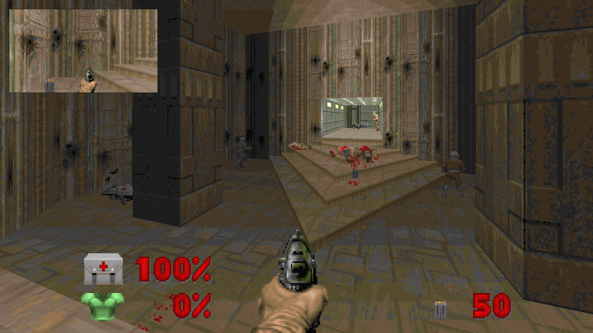
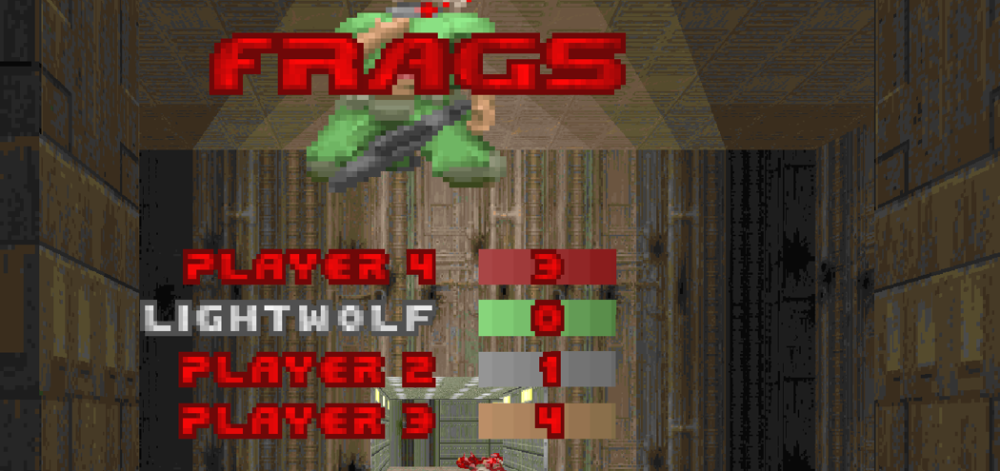

<div align="center">

# AutoDoom PIP + Launcher

**Picture-in-picture and a friendly launcher for [AutoDoom](https://github.com/ioan-chera/AutoDoom) — Ioan Chera's Eternity Engine fork with a pathfinding bot.**

[](https://github.com/LightWolfMan/autodoom-pip/releases/latest)
[](https://github.com/LightWolfMan/autodoom-pip/releases)
[](COPYING-GPLv3)
[](LICENSE-launcher.md)
[](#requirements)

**English** · [Português](#português)



</div>

---

Watching a bot play is more fun when you can see what *it* sees. This project adds a corner box
rendering another player's view **in the same frame** as your own, plus a launcher that ties the
loose ends of running AutoDoom together.

## Table of contents

- [Features](#features)
- [Requirements](#requirements)
- [Installation](#installation)
- [Usage](#usage)
- [Configuration](#configuration)
- [Building from source](#building-from-source)
- [How it works](#how-it-works)
- [Known limitations](#known-limitations)
- [Contributing](#contributing)
- [Licence](#licence)
- [Credits](#credits)

## Features

- **Picture-in-picture** — one to three corner boxes with other players' views, rendered in the
  same frame. Off by default.
- **Follows the leader** — with a single box it tracks whoever has the most kills, or whoever is
  closest to the exit, your choice. `F12` borrows the box for ten seconds, then it goes back.
- **Coloured frame and micro HUD** — each box is framed in that player's own colour, taken from
  the game's translation tables, and flashes white when they take a hit. Health and ammo are
  printed under the box, in the same colour.
- **Friendly fire switch** — co-op in Doom lets players hurt each other; you can turn that off.
- **Launcher** — IWAD and PWAD pickers, a copilot switch, 0–3 bot companions, and a WAD finder
  that reads the NTFS journal instead of walking the disk.
- **Nobody leaves without asking** — a bot that reaches the exit switch stops there and asks
  you, with the engine's own yes/no prompt. Say no and the level gets another minute before
  anyone asks again.
- **Co-op scoreboard** — hold `F` for a ranking by kills. Eternity's scoreboard was deathmatch
  only; a small patch opens it up.
- **Game logos in the list** — each IWAD shows its own logo, read straight out of that WAD
  (`M_DOOM`), and they are listed in release order.
- **Bilingual** — the launcher always follows your Windows language, English or Portuguese, with
  nothing to configure.
- **Non-destructive** — installs *beside* your `AutoDoom.exe`, never replacing it.


## Requirements

| | |
| --- | --- |
| OS | Windows 10 or 11 |
| Game | An existing [AutoDoom](https://github.com/ioan-chera/AutoDoom) install, with `AutoDoom.exe` and the SDL2 DLLs |
| IWAD | Any Doom, Doom II, Final Doom, Heretic or Freedoom IWAD |
| Runtime | [.NET 9 Desktop Runtime](https://dotnet.microsoft.com/download/dotnet/9.0) — for the launcher only; the game itself needs nothing extra |
| Optional | Administrator rights and an NTFS volume with an active USN journal, for the WAD finder |

## Installation

1. Download **`AutoDoomPip-Setup.exe`** from the [latest release](https://github.com/LightWolfMan/autodoom-pip/releases/latest).
2. Run it and point it at the folder that contains `AutoDoom.exe`. The installer refuses to
   continue anywhere else.
3. Launch **AutoDoom Launcher** from the Start menu.

Prefer the command line? The release also ships a PowerShell installer:

```powershell
.\Install-AutoDoomPip.ps1 -Target "D:\Games\AutoDoom"
```

To uninstall, use *Apps & features* in Windows, or the shortcut in the Start menu folder. Your
original `AutoDoom.exe` is never touched.

## Usage

Open the launcher, pick an IWAD, set the two switches below and press **Play**.

| Switch | What happens |
| --- | --- |
| **Copilot** | On: the bot plays *your* character and hands control back the moment you touch the keys, taking it again a second after you stop. Off: you play your own character throughout. |
| **Bot companions** | 0 to 3 extra bot players, filling slots 2 to 4. Three is the engine ceiling — `MAXPLAYERS` is 4 and one slot is yours. |

The two are independent, which stock `-bots` cannot express: any count from 1 to 3 turned
the copilot off, and only `-bots 4` brought it back. The engine gained a `-copilot <0|1>`
parameter that decides `bots[0].active` after the `-bots` rule has run, so "one companion
**and** the copilot" is now a thing. Without the parameter nothing changes.

In game:

| Key | Action |
| --- | --- |
| `F` (hold) | Kill scoreboard |
| `Y` | Answer yes when a bot asks to take the exit |
| `Backspace` | Shove every bot loose when one gets stuck |
| `F12` | Move the PIP box to the next player, for ten seconds |
| `Space` | Jump, when enabled in the launcher |

### The keyboard layout

Eternity still ships the 1993 keyboard: arrows to walk, no WASD. This project carries a
modern one in [`keys/autodoom-modern.csc`](keys/autodoom-modern.csc) — `WASD` to move, `E`
to use, `Ctrl` and `mouse1` to fire, `mouse2` for the alternate attack, `Space` to jump,
`R` to reload, `Shift` to run, `Alt` to strafe, plus the four keys above.

The launcher writes it into any profile that has **no** `keys.csc` yet. A profile that
already exists is left alone — your own keys are yours — and only gains the `Backspace`
binding, which is added without removing anything. To adopt it by hand, copy the file over
`user/<game>/keys.csc` with the game closed; the engine rewrites that file on exit.



## Configuration

Picture-in-picture is off by default. Turn it on with the launcher checkbox, with `-pip` on the
command line, or with the console variables below — all of them are saved in `eternity.cfg`.

| cvar | What it does | Default | Range |
| --- | --- | --- | --- |
| `pip` | Turns the box on | `0` | `0`–`1` |
| `pip_size` | Size of each box, as a percentage of the screen | `25` | `10`–`50` |
| `pip_count` | How many boxes, laid out left to right | `1` | `1`–`3` |
| `pip_bottom` | `0` = top row, `1` = bottom row | `0` | `0`–`1` |
| `pip_follow` | `0` = whoever kills the most, `1` = whoever is closest to the exit | `0` | `0`–`1` |

Exit approval has its own switches:

| cvar | What it does | Default |
| --- | --- | --- |
| `bot_exitvote` | Bots must ask before taking the exit | `1` |
| `bot_exitvote_delay` | Seconds to wait after a refusal | `60` |
| `bot_exitvote_log` | Write what happened to `vote.log` | `0` |
| `bot_friendlyfire` | Players can hurt each other in co-op | `1` |

`vote_yes` and `vote_no` answer from the console, if you would rather bind keys than use the
prompt.

The launcher also flips two engine settings that have nothing to do with PIP:

- **Weapons disappear when picked up** — Doom's co-op default leaves weapons on the floor for
  everyone (`DM_WEAPONSTAY`), which makes the game noticeably easier. The launcher passes
  `-dmflags 0`.
- **Jumping** — supported by the engine since forever, disabled behind `comp_aircontrol`.

## Building from source

```
msbuild vc2019\Eternity.sln /p:Configuration=Release /p:Platform=Win32 ^
  /p:PlatformToolset=v143 /p:SDL2_0=<sdl2> /p:SDLMIXER2_0=<mixer> /p:SDLNET2_0=<net>
```

Two things that cost an afternoon:

- The **`adlmidi` submodule must be populated** (`git submodule update --init`), otherwise the
  build fails on missing source files.
- **Build Win32.** If the binary is going to sit next to the 32-bit DLLs that ship with
  AutoDoom, an x64 build dies with `0xc000007b`.

The launcher builds with `dotnet publish -c Release -r win-x64 --self-contained false
-p:PublishSingleFile=true`; its source is in [`launcher-src/`](launcher-src).

## How it works

`R_RenderPlayerView` clears every buffer it uses on entry — clip segs, draw segs, planes,
portals, sprites — so **calling it twice in one frame is safe**. The geometry is what needs
care: `R_RenderPipView` saves `viewwindow`, the `cb_view_t`, the centers and the per-column
height table, swaps in the box rectangle, renders, and puts everything back.

The cost is not double. The BSP walk and thing setup repeat in full while only the pixel work
scales with the box area, so a 25% box costs noticeably less than a second full render — but it
is not free, and on a software renderer that time competes with the bot's own thinking.

Eternity already renders alternate viewpoints through skybox and anchored portals; those are
always tied to map geometry. This is the same renderer pointed at a screen-space rectangle and
a player instead.

## Known limitations

- Windows only, tested on a 32-bit Release build.
- The WAD finder needs administrator rights and an active NTFS journal. Without them the button
  stays disabled and says why, instead of falling back to an hours-long disk sweep.
- `pip_count` above `1` is implemented but has had little real use.
- No crouching: there is no crouch code anywhere in Eternity, only an unused ACS constant.

## Contributing

Issues and pull requests are welcome. The engine change is offered upstream at
[ioan-chera/AutoDoom](https://github.com/ioan-chera/AutoDoom); the modified source lives in
[LightWolfMan/AutoDoom, branch `pip-view`](https://github.com/LightWolfMan/AutoDoom/tree/pip-view).

## Licence

This repository carries two works with different origins.

| Part | Licence | Why |
| --- | --- | --- |
| `autodoom_pip.exe`, `autodoom-pip.patch` | [GPL-3.0](COPYING-GPLv3) | Derived from the Eternity Engine and AutoDoom. The modified source is published [here](https://github.com/LightWolfMan/AutoDoom/tree/pip-view). |
| Launcher, installer script | [MIT](LICENSE-launcher.md) | Written from scratch; does not derive from Eternity. |

## Credits

- [Ioan Chera](https://github.com/ioan-chera) — AutoDoom and its pathfinding bot.
- [Team Eternity](https://github.com/team-eternity/eternity) — the Eternity Engine.
- id Software — Doom.

---

<div align="center">

# Português

**Picture-in-picture e um launcher amigável para o [AutoDoom](https://github.com/ioan-chera/AutoDoom) — o fork do Eternity Engine com o bot do Ioan Chera.**

[English](#autodoom-pip--launcher) · **Português**

</div>

Ver um bot jogar fica bem melhor quando dá para ver o que *ele* vê. Este projeto acrescenta um
quadrinho no canto com a visão de outro jogador, desenhado **no mesmo quadro** que a sua, mais um
launcher que amarra as pontas soltas de rodar o AutoDoom.

## Índice

- [Recursos](#recursos)
- [Requisitos](#requisitos)
- [Instalação](#instalação)
- [Como usar](#como-usar)
- [Configuração](#configuração)
- [Compilando](#compilando)
- [Como funciona](#como-funciona)
- [Limitações conhecidas](#limitações-conhecidas)
- [Licença](#licença-1)

## Recursos

- **Picture-in-picture** — de um a três quadrinhos com a visão de outros jogadores, desenhados no
  mesmo quadro. Vem desligado.
- **Segue o líder** — com um quadrinho só, ele acompanha quem mais matou, ou quem está mais
  perto da saída, você escolhe. O `F12` empresta o quadrinho por dez segundos e ele volta.
- **Moldura colorida e micro HUD** — cada quadrinho é emoldurado na cor daquele jogador, tirada
  das tabelas de tradução do próprio jogo, e pisca de branco quando ele leva dano. Vida e
  munição saem embaixo do quadro, na mesma cor.
- **Fogo amigo** — no coop do Doom os jogadores se ferem; dá para desligar.
- **Launcher** — escolha de IWAD e PWAD, interruptor de copiloto, 0 a 3 bots companheiros, e um detector de
  WADs que lê o journal do NTFS em vez de varrer o disco.
- **Ninguém sai sem perguntar** — o bot que chega no botão da saída para ali e pergunta, com o
  mesmo diálogo de sim/não que a engine usa para sair do jogo. Diga não e o mapa ganha mais um
  minuto antes de alguém perguntar de novo.
- **Placar no coop** — segure `F` para o ranking por abates. O placar do Eternity só valia em
  deathmatch; um patch pequeno abriu.
- **Logos dos jogos na lista** — cada IWAD mostra o próprio logo, lido de dentro daquele WAD
  (`M_DOOM`), e a lista vem em ordem de lançamento.
- **Bilíngue** — o launcher sempre acompanha o idioma do Windows, português ou inglês, sem nada
  para configurar.
- **Não destrutivo** — instala *ao lado* do seu `AutoDoom.exe`, nunca por cima.


## Requisitos

| | |
| --- | --- |
| Sistema | Windows 10 ou 11 |
| Jogo | Uma instalação do [AutoDoom](https://github.com/ioan-chera/AutoDoom), com `AutoDoom.exe` e as DLLs do SDL2 |
| IWAD | Qualquer IWAD de Doom, Doom II, Final Doom, Heretic ou Freedoom |
| Runtime | [.NET 9 Desktop Runtime](https://dotnet.microsoft.com/download/dotnet/9.0) — só para o launcher; o jogo não precisa de nada |
| Opcional | Direitos de administrador e volume NTFS com journal ativo, para o detector de WADs |

## Instalação

1. Baixe o **`AutoDoomPip-Setup.exe`** na [última release](https://github.com/LightWolfMan/autodoom-pip/releases/latest).
2. Rode e aponte para a pasta que contém o `AutoDoom.exe`. O instalador se recusa a continuar em
   qualquer outro lugar.
3. Abra o **AutoDoom Launcher** pelo Menu Iniciar.

Pela linha de comando:

```powershell
.\Install-AutoDoomPip.ps1 -Target "D:\Jogos\AutoDoom"
```

Para desinstalar, use *Aplicativos e recursos* do Windows. O seu `AutoDoom.exe` original nunca é
tocado.

## Como usar

| Interruptor | O que acontece |
| --- | --- |
| **Copiloto** | Ligado: o bot joga o *seu* personagem e devolve o controle no instante em que você toca nas teclas, retomando um segundo depois que você para. Desligado: você joga o seu personagem do início ao fim. |
| **Bots companheiros** | De 0 a 3 jogadores-bot extras, nos slots 2 a 4. Três é o teto da engine — `MAXPLAYERS` é 4 e um slot é o seu. |

Os dois são independentes, o que o `-bots` original não sabia dizer: qualquer número de 1 a
3 desligava o copiloto, e só o `-bots 4` o trazia de volta. A engine ganhou um parâmetro
`-copilot <0|1>` que decide o `bots[0].active` depois da regra do `-bots`, então "um
companheiro **e** o copiloto" agora existe. Sem o parâmetro, nada muda.

No jogo:

| Tecla | Ação |
| --- | --- |
| `F` (segurando) | Placar de abates |
| `Y` | Responde sim quando um bot pede para sair |
| `Backspace` | Destrava os bots, empurrando todos para trás |
| `F12` | Passa o quadrinho para o próximo jogador, por dez segundos |
| `Espaço` | Pular, quando ligado no launcher |

### O teclado

A engine ainda entrega o teclado de 1993: setas para andar, sem WASD. O projeto carrega um
moderno em [`keys/autodoom-modern.csc`](keys/autodoom-modern.csc) — `WASD` para andar, `E`
para usar, `Ctrl` e `mouse1` para atirar, `mouse2` para o tiro alternativo, `Espaço` para
pular, `R` para recarregar, `Shift` para correr, `Alt` para strafe, mais as quatro teclas
da tabela acima.

O launcher escreve esse arquivo em qualquer perfil que **ainda não tenha** `keys.csc`. Perfil
que já existe fica intacto — as suas teclas são suas — e só ganha o bind do `Backspace`, que
é acrescentado sem apagar nada. Para adotar na mão, copie o arquivo por cima do
`user/<jogo>/keys.csc` com o jogo fechado; a engine reescreve esse arquivo ao sair.

## Configuração

| cvar | O que faz | Padrão | Faixa |
| --- | --- | --- | --- |
| `pip` | Liga o quadrinho | `0` | `0`–`1` |
| `pip_size` | Tamanho de cada quadrinho, em % da tela | `25` | `10`–`50` |
| `pip_count` | Quantos quadrinhos, da esquerda para a direita | `1` | `1`–`3` |
| `pip_bottom` | `0` = fila em cima, `1` = embaixo | `0` | `0`–`1` |
| `pip_follow` | `0` = quem mais mata, `1` = quem está mais perto da saída | `0` | `0`–`1` |

A autorização de saída tem as suas:

| cvar | O que faz | Padrão |
| --- | --- | --- |
| `bot_exitvote` | O bot precisa pedir antes de acionar a saída | `1` |
| `bot_exitvote_delay` | Segundos de espera depois de um "não" | `60` |
| `bot_exitvote_log` | Grava o que aconteceu em `vote.log` | `0` |
| `bot_friendlyfire` | Jogadores se ferem no coop | `1` |

`vote_yes` e `vote_no` respondem pelo console, se você preferir teclas ao diálogo.

O launcher também mexe em duas opções da engine que nada têm a ver com o PIP:

- **Armas somem ao pegar** — o padrão do coop do Doom deixa a arma no chão para todo mundo
  (`DM_WEAPONSTAY`), o que facilita bastante. O launcher passa `-dmflags 0`.
- **Pulo** — a engine sempre teve, desativado atrás do `comp_aircontrol`.

## Compilando

```
msbuild vc2019\Eternity.sln /p:Configuration=Release /p:Platform=Win32 ^
  /p:PlatformToolset=v143 /p:SDL2_0=<sdl2> /p:SDLMIXER2_0=<mixer> /p:SDLNET2_0=<net>
```

Duas pedras que custaram uma tarde: o submódulo **`adlmidi` precisa estar populado**
(`git submodule update --init`), e **compile em Win32** — um build x64 ao lado das DLLs de 32
bits do AutoDoom morre com `0xc000007b`.

## Como funciona

O `R_RenderPlayerView` limpa todos os buffers que usa logo na entrada — clip segs, draw segs,
planos, portais, sprites —, então **chamar duas vezes no mesmo quadro é seguro**. O que precisa
de cuidado é a geometria: o `R_RenderPipView` salva `viewwindow`, o `cb_view_t`, os centros e a
tabela de altura por coluna, troca pelo retângulo do quadrinho, renderiza e devolve tudo.

O custo não é o dobro. O passeio pela BSP e o processamento de coisas se repetem inteiros, e só
o trabalho de pixel escala com a área, então um quadrinho de 25% custa bem menos que um segundo
render completo — mas custa, e num renderizador por software esse tempo disputa com o
pensamento do bot.

## Limitações conhecidas

- Só Windows, testado em build Release de 32 bits.
- O detector de WADs exige administrador e journal NTFS ativo. Sem isso o botão fica desabilitado
  e explica o motivo, em vez de cair numa varredura de horas.
- `pip_count` maior que `1` está implementado, mas foi pouco usado de verdade.
- Não há agachamento: não existe código de crouch no Eternity, apenas uma constante de ACS sem uso.

## Licença

| Parte | Licença | Por quê |
| --- | --- | --- |
| `autodoom_pip.exe`, `autodoom-pip.patch` | [GPL-3.0](COPYING-GPLv3) | Derivado do Eternity Engine e do AutoDoom. O fonte modificado está publicado [aqui](https://github.com/LightWolfMan/AutoDoom/tree/pip-view). |
| Launcher, script de instalação | [MIT](LICENSE-launcher.md) | Escrito do zero; não deriva do Eternity. |
