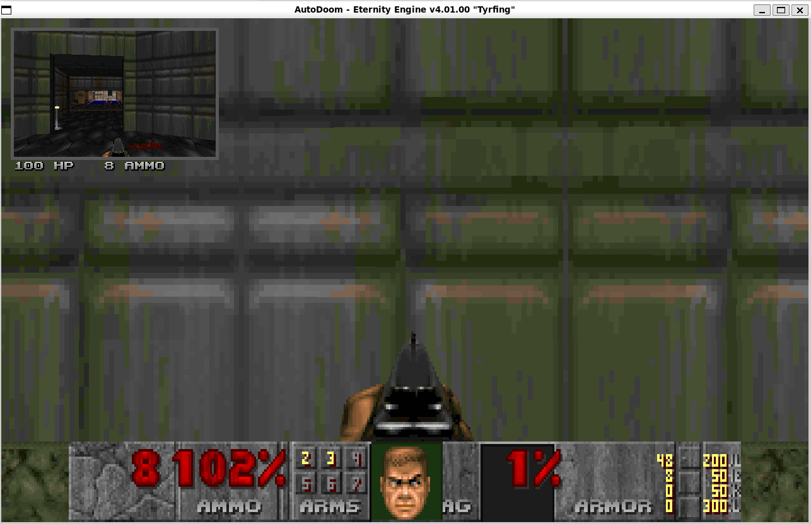
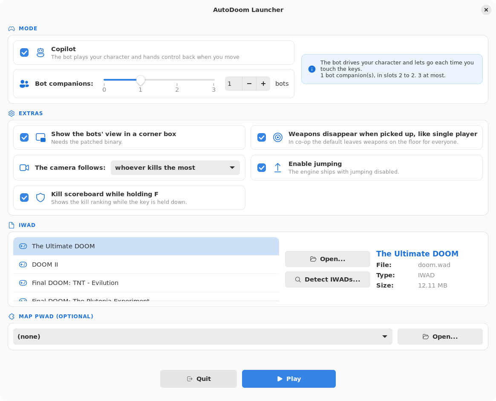
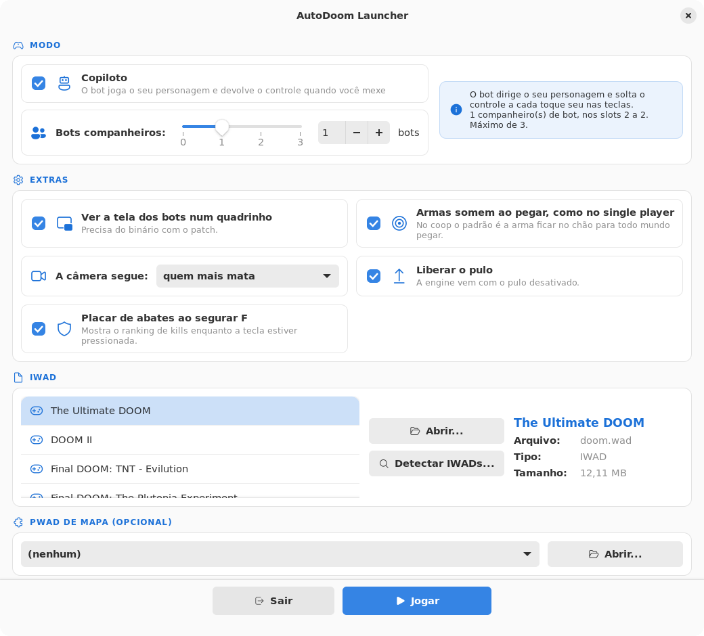

<div align="center">

# AutoDoom PIP + Launcher

**Picture-in-picture and a friendly launcher for [AutoDoom](https://github.com/ioan-chera/AutoDoom) — Ioan Chera's Eternity Engine fork with a pathfinding bot.**

[](https://github.com/LightWolfMan/autodoom-pip/releases/latest)
[](https://github.com/LightWolfMan/autodoom-pip/releases)
[](COPYING-GPLv3)
[](LICENSE-launcher.md)
[](#requirements)

**English** · [Português](#português)



<sub>Built and captured on Ubuntu 24.04.</sub>

</div>

---

Watching a bot play is more fun when you can see what *it* sees. This project adds a corner box
rendering another player's view **in the same frame** as your own, plus a launcher that ties the
loose ends of running AutoDoom together.

## Table of contents

- [Features](#features)
- [Requirements](#requirements)
- [Installation](#installation)
- [Usage](#usage)
- [Configuration](#configuration)
- [Building from source](#building-from-source)
- [How it works](#how-it-works)
- [Known limitations](#known-limitations)
- [Contributing](#contributing)
- [Licence](#licence)
- [Credits](#credits)

## Features

- **Picture-in-picture** — one to three corner boxes with other players' views, rendered in the
  same frame. Off by default.
- **Follows the leader** — with a single box it tracks whoever has the most kills, or whoever is
  closest to the exit, your choice. `F12` borrows the box for ten seconds, then it goes back.
- **Coloured frame and micro HUD** — each box is framed in that player's own colour, taken from
  the game's translation tables, and flashes white when they take a hit. Health and ammo are
  printed under the box, in the same colour.
- **Friendly fire switch** — co-op in Doom lets players hurt each other; you can turn that off.
- **Launcher** — a GTK4 + libadwaita window in [`linux-launcher/`](linux-launcher): IWAD and
  PWAD pickers, the copilot switch, 0–3 companions, and the engine settings written for you.
  Finding WADs uses `plocate`: `locate '*.wad'` answers in milliseconds, needs no privilege,
  and ships on most Debian and Arch desktops.
- **Nobody leaves without asking** — a bot that reaches the exit switch stops there and asks
  you, with the engine's own yes/no prompt. Say no and the level gets another minute before
  anyone asks again.
- **Co-op scoreboard** — hold `F` for a ranking by kills. Eternity's scoreboard was deathmatch
  only; a small patch opens it up.
- **Game logos in the list** — each IWAD shows its own logo, read straight out of that WAD
  (`M_DOOM`), and they are listed in release order.
- **Bilingual** — the launcher follows your system language, English or Portuguese, with nothing
  to configure.
- **Non-destructive** — the patched binary sits *beside* a stock AutoDoom build, never on top of it.



<sub>The launcher follows your locale — this is the same window under
<code>LC_ALL=en_US.UTF-8</code>.</sub>

### The keyboard layout

Eternity boots the 1993 keyboard — arrows to walk, no WASD — and on Linux you get it fresh,
because a fresh install has **no bindings at all**: the engine starts from an empty profile and
says `keys.csc not found, using defaults`.

The project's layout is in [`keys/autodoom-modern.csc`](keys/autodoom-modern.csc): `WASD` to
move, `E` to use, `Ctrl` and `mouse1` to fire, `mouse2` for the alternate attack, `Space` to
jump, `R` to reload, `Shift` to run, `Alt` to strafe, `F` for the scoreboard, `Backspace` for
`bot_unstick` and `F12` to cycle the PIP occupant.

```
cp keys/autodoom-modern.csc ~/AutoDoom/user/doom/keys.csc   # with the game closed
```

The launcher does this for you, and only for profiles that have no `keys.csc` yet —
an existing profile keeps its owner's keys.

## Requirements

| | |
| --- | --- |
| OS | Linux. Verified on Ubuntu 24.04; Debian and Arch are the targets |
| Build | GCC 13+ or Clang, CMake 3.x, SDL2 + SDL2_mixer + SDL2_net development packages |
| IWAD | Any Doom, Doom II, Final Doom, Heretic or Freedoom IWAD |
| Launcher | Python 3.11+, PyGObject, GTK 4 and libadwaita — only for the launcher; the game needs none of it |
| Optional | `plocate`, so the launcher can find WADs outside the usual folders |

## Installation

There is no binary release for Linux yet — you build it, and it takes one command.

**Debian / Ubuntu**

```
sudo apt install build-essential cmake git pkg-config      libsdl2-dev libsdl2-mixer-dev libsdl2-net-dev plocate
```

**Arch**

```
sudo pacman -S --needed base-devel cmake git sdl2 sdl2_mixer sdl2_net plocate
```

Then:

```
git clone https://github.com/LightWolfMan/autodoom-pip.git -b linux
./autodoom-pip/tools/build_linux.sh
```

The script clones AutoDoom, populates the `adlmidi` submodule, applies the patch and builds.
Nothing is installed system-wide and nothing of yours is overwritten: the binary stays in the
build tree until you decide where to put it.

## Usage

Open the launcher, pick an IWAD, set the two switches below and press **Play**.

| Switch | What happens |
| --- | --- |
| **Copilot** | On: the bot plays *your* character and hands control back the moment you touch the keys, taking it again a second after you stop. Off: you play your own character throughout. |
| **Bot companions** | 0 to 3 extra bot players, filling slots 2 to 4. Three is the engine ceiling — `MAXPLAYERS` is 4 and one slot is yours. |

The two are independent, which stock `-bots` cannot express: any count from 1 to 3 turned
the copilot off, and only `-bots 4` brought it back. The engine gained a `-copilot <0|1>`
parameter that decides `bots[0].active` after the `-bots` rule has run, so "one companion
**and** the copilot" is now a thing. Without the parameter nothing changes.

In game:

| Key | Action |
| --- | --- |
| `F` (hold) | Kill scoreboard |
| `Y` | Answer yes when a bot asks to take the exit |
| `Backspace` | Shove every bot loose when one gets stuck |
| `F12` | Move the PIP box to the next player, for ten seconds |
| `Space` | Jump, when enabled in the launcher |

<sub>(No screenshot of the scoreboard yet — it needs a key held down while the shot is taken.)</sub>

## Configuration

Picture-in-picture is off by default. Turn it on with the launcher checkbox, with `-pip` on the
command line, or with the console variables below — all of them are saved in `eternity.cfg`.

| cvar | What it does | Default | Range |
| --- | --- | --- | --- |
| `pip` | Turns the box on | `0` | `0`–`1` |
| `pip_size` | Size of each box, as a percentage of the screen | `25` | `10`–`50` |
| `pip_count` | How many boxes, laid out left to right | `1` | `1`–`3` |
| `pip_bottom` | `0` = top row, `1` = bottom row | `0` | `0`–`1` |
| `pip_follow` | `0` = whoever kills the most, `1` = whoever is closest to the exit | `0` | `0`–`1` |

Exit approval has its own switches:

| cvar | What it does | Default |
| --- | --- | --- |
| `bot_exitvote` | Bots must ask before taking the exit | `1` |
| `bot_exitvote_delay` | Seconds to wait after a refusal | `60` |
| `bot_exitvote_log` | Write what happened to `vote.log` | `0` |
| `bot_friendlyfire` | Players can hurt each other in co-op | `1` |

`vote_yes` and `vote_no` answer from the console, if you would rather bind keys than use the
prompt.

The launcher also flips two engine settings that have nothing to do with PIP:

- **Weapons disappear when picked up** — Doom's co-op default leaves weapons on the floor for
  everyone (`DM_WEAPONSTAY`), which makes the game noticeably easier. The launcher passes
  `-dmflags 0`.
- **Jumping** — supported by the engine since forever, disabled behind `comp_aircontrol`.

## Building from source

Eternity ships a full `CMakeLists.txt`, and the patch is plain C++ on the standard library —
`fopen`, `fprintf` and the engine's own `psnprintf`. `b_vote.cpp` joins the build by itself,
because `source/CMakeLists.txt` collects sources with `FILE (GLOB autodoom/*.cpp)`.

```
sudo apt install build-essential cmake git pkg-config      libsdl2-dev libsdl2-mixer-dev libsdl2-net-dev
git clone --branch AutoDoom https://github.com/ioan-chera/AutoDoom.git && cd AutoDoom
git submodule update --init --recursive
git apply /path/to/autodoom-pip.patch
mkdir build && cd build && cmake .. -DCMAKE_BUILD_TYPE=Release && make -j$(nproc)
ln -s ../../base source/base       # the engine wants base/ next to the binary
```

[`tools/build_linux.sh`](tools/build_linux.sh) does all of that. Verified on Ubuntu 24.04
(CMake 3.28.3, GCC 13.3, SDL2 2.30): the patch applied clean, the build finished with **zero
errors**, and the running game showed the PIP box and the exit vote. The copilot was measured
by frame difference, since the bot needs no input to prove itself — 76.4% of pixels changing
over five seconds with `-copilot 1` against 0.0% with `-copilot 0`.

One thing to watch: `cmake_minimum_required (VERSION 2.6)` is only a warning under CMake 3.x
but an **error under CMake 4**, which newer distributions ship.

**A fresh build starts with an empty profile.** The engine boots with `keys.csc not found,
using defaults`, so none of the project's bindings exist yet — no `F` for the scoreboard, no
`Backspace` for `bot_unstick`. Copy `keys/autodoom-modern.csc` over
`<game>/user/<game>/keys.csc`, or let the launcher do it.

## How it works

`R_RenderPlayerView` clears every buffer it uses on entry — clip segs, draw segs, planes,
portals, sprites — so **calling it twice in one frame is safe**. The geometry is what needs
care: `R_RenderPipView` saves `viewwindow`, the `cb_view_t`, the centers and the per-column
height table, swaps in the box rectangle, renders, and puts everything back.

The cost is not double. The BSP walk and thing setup repeat in full while only the pixel work
scales with the box area, so a 25% box costs noticeably less than a second full render — but it
is not free, and on a software renderer that time competes with the bot's own thinking.

Eternity already renders alternate viewpoints through skybox and anchored portals; those are
always tied to map geometry. This is the same renderer pointed at a screen-space rectangle and
a player instead.

## Known limitations

- The launcher is a **release candidate**: it does everything the window offers, but it has
  not had months of real use behind it yet. The IWAD panel shows name, file, type and size —
  not the logo drawn from inside the WAD — and a PWAD is chosen by hand, without the
  compatibility check.
- Finding WADs depends on `plocate`'s database. A WAD created after the last `updatedb` run is
  invisible until the next one — run `sudo updatedb` if something is missing. There is no
  the filesystem keeps no queryable diary of file names, so an index is the only fast answer.
- `pip_count` above `1` is implemented but has had little real use.
- No crouching: there is no crouch code anywhere in Eternity, only an unused ACS constant.

## Contributing

Issues and pull requests are welcome. The engine change is offered upstream at
[ioan-chera/AutoDoom](https://github.com/ioan-chera/AutoDoom); the modified source lives in
[LightWolfMan/AutoDoom, branch `pip-view`](https://github.com/LightWolfMan/AutoDoom/tree/pip-view).

## Licence

This repository carries two works with different origins.

| Part | Licence | Why |
| --- | --- | --- |
| The patched engine, `autodoom-pip.patch` | [GPL-3.0](COPYING-GPLv3) | Derived from the Eternity Engine and AutoDoom. The modified source is published [here](https://github.com/LightWolfMan/AutoDoom/tree/pip-view). |
| Launcher, installer script | [MIT](LICENSE-launcher.md) | Written from scratch; does not derive from Eternity. |

## Credits

- [Ioan Chera](https://github.com/ioan-chera) — AutoDoom and its pathfinding bot.
- [Team Eternity](https://github.com/team-eternity/eternity) — the Eternity Engine.
- id Software — Doom.

---

<div align="center">

# Português

**Picture-in-picture e um launcher amigável para o [AutoDoom](https://github.com/ioan-chera/AutoDoom) — o fork do Eternity Engine com o bot do Ioan Chera.**

[English](#autodoom-pip--launcher) · **Português**

</div>

Ver um bot jogar fica bem melhor quando dá para ver o que *ele* vê. Este projeto acrescenta um
quadrinho no canto com a visão de outro jogador, desenhado **no mesmo quadro** que a sua, mais um
launcher que amarra as pontas soltas de rodar o AutoDoom.

## Índice

- [Recursos](#recursos)
- [Requisitos](#requisitos)
- [Instalação](#instalação)
- [Como usar](#como-usar)
- [Configuração](#configuração)
- [Compilando](#compilando)
- [Como funciona](#como-funciona)
- [Limitações conhecidas](#limitações-conhecidas)
- [Licença](#licença-1)

## Recursos

- **Picture-in-picture** — de um a três quadrinhos com a visão de outros jogadores, desenhados no
  mesmo quadro. Vem desligado.
- **Segue o líder** — com um quadrinho só, ele acompanha quem mais matou, ou quem está mais
  perto da saída, você escolhe. O `F12` empresta o quadrinho por dez segundos e ele volta.
- **Moldura colorida e micro HUD** — cada quadrinho é emoldurado na cor daquele jogador, tirada
  das tabelas de tradução do próprio jogo, e pisca de branco quando ele leva dano. Vida e
  munição saem embaixo do quadro, na mesma cor.
- **Fogo amigo** — no coop do Doom os jogadores se ferem; dá para desligar.
- **Launcher** — uma janela GTK4 + libadwaita em [`linux-launcher/`](linux-launcher): escolha
  de IWAD e PWAD, o interruptor do copiloto, 0 a 3 companheiros e a configuração da engine
  escrita para você. A busca de WADs usa `plocate`: `locate '*.wad'` responde em
  milissegundos, não pede privilégio nenhum e vem na maioria dos desktops Debian e Arch.
- **Ninguém sai sem perguntar** — o bot que chega no botão da saída para ali e pergunta, com o
  mesmo diálogo de sim/não que a engine usa para sair do jogo. Diga não e o mapa ganha mais um
  minuto antes de alguém perguntar de novo.
- **Placar no coop** — segure `F` para o ranking por abates. O placar do Eternity só valia em
  deathmatch; um patch pequeno abriu.
- **Logos dos jogos na lista** — cada IWAD mostra o próprio logo, lido de dentro daquele WAD
  (`M_DOOM`), e a lista vem em ordem de lançamento.
- **Bilíngue** — o launcher acompanha o idioma do sistema, português ou inglês, sem nada
  para configurar.
- **Não destrutivo** — o binário com o patch fica *ao lado* de um AutoDoom comum, nunca por cima.



<sub>O launcher acompanha o idioma do sistema — esta é a mesma janela com o locale em
português.</sub>

### O teclado

A engine sobe com o teclado de 1993 — setas para andar, sem WASD — e no Linux você pega ele
zerado, porque uma instalação nova **não tem bind nenhum**: o perfil começa vazio e a engine
avisa `keys.csc not found, using defaults`.

O teclado do projeto está em [`keys/autodoom-modern.csc`](keys/autodoom-modern.csc): `WASD`
para andar, `E` para usar, `Ctrl` e `mouse1` para atirar, `mouse2` para o tiro alternativo,
`Espaço` para pular, `R` para recarregar, `Shift` para correr, `Alt` para strafe, `F` para o
placar, `Backspace` para o `bot_unstick` e `F12` para girar quem aparece no quadrinho.

```
cp keys/autodoom-modern.csc ~/AutoDoom/user/doom/keys.csc   # com o jogo fechado
```

O launcher já faz isso sozinho, e só em perfil que ainda não tem `keys.csc` —
perfil existente mantém as teclas do dono.

## Requisitos

| | |
| --- | --- |
| Sistema | Linux. Verificado na Ubuntu 24.04; o alvo são Debian e Arch |
| Build | GCC 13+ ou Clang, CMake 3.x, pacotes de desenvolvimento do SDL2, SDL2_mixer e SDL2_net |
| IWAD | Qualquer IWAD de Doom, Doom II, Final Doom, Heretic ou Freedoom |
| Launcher | Python 3.11+, PyGObject, GTK 4 e libadwaita — só para o launcher; o jogo não precisa de nada disso |
| Opcional | `plocate`, para o launcher achar WAD fora das pastas usuais |

## Instalação

Ainda não há release binária para Linux — aqui você compila, e é um comando.

**Debian / Ubuntu**

```
sudo apt install build-essential cmake git pkg-config      libsdl2-dev libsdl2-mixer-dev libsdl2-net-dev plocate
```

**Arch**

```
sudo pacman -S --needed base-devel cmake git sdl2 sdl2_mixer sdl2_net plocate
```

Depois:

```
git clone https://github.com/LightWolfMan/autodoom-pip.git -b linux
./autodoom-pip/tools/build_linux.sh
```

O script clona o AutoDoom, popula o submódulo `adlmidi`, aplica o patch e compila. Nada é
instalado no sistema e nada seu é sobrescrito: o binário fica na árvore de build até você
decidir onde colocá-lo.

## Como usar

| Interruptor | O que acontece |
| --- | --- |
| **Copiloto** | Ligado: o bot joga o *seu* personagem e devolve o controle no instante em que você toca nas teclas, retomando um segundo depois que você para. Desligado: você joga o seu personagem do início ao fim. |
| **Bots companheiros** | De 0 a 3 jogadores-bot extras, nos slots 2 a 4. Três é o teto da engine — `MAXPLAYERS` é 4 e um slot é o seu. |

Os dois são independentes, o que o `-bots` original não sabia dizer: qualquer número de 1 a
3 desligava o copiloto, e só o `-bots 4` o trazia de volta. A engine ganhou um parâmetro
`-copilot <0|1>` que decide o `bots[0].active` depois da regra do `-bots`, então "um
companheiro **e** o copiloto" agora existe. Sem o parâmetro, nada muda.

No jogo:

| Tecla | Ação |
| --- | --- |
| `F` (segurando) | Placar de abates |
| `Y` | Responde sim quando um bot pede para sair |
| `Backspace` | Destrava os bots, empurrando todos para trás |
| `F12` | Passa o quadrinho para o próximo jogador, por dez segundos |
| `Espaço` | Pular, quando ligado no launcher |

## Configuração

| cvar | O que faz | Padrão | Faixa |
| --- | --- | --- | --- |
| `pip` | Liga o quadrinho | `0` | `0`–`1` |
| `pip_size` | Tamanho de cada quadrinho, em % da tela | `25` | `10`–`50` |
| `pip_count` | Quantos quadrinhos, da esquerda para a direita | `1` | `1`–`3` |
| `pip_bottom` | `0` = fila em cima, `1` = embaixo | `0` | `0`–`1` |
| `pip_follow` | `0` = quem mais mata, `1` = quem está mais perto da saída | `0` | `0`–`1` |

A autorização de saída tem as suas:

| cvar | O que faz | Padrão |
| --- | --- | --- |
| `bot_exitvote` | O bot precisa pedir antes de acionar a saída | `1` |
| `bot_exitvote_delay` | Segundos de espera depois de um "não" | `60` |
| `bot_exitvote_log` | Grava o que aconteceu em `vote.log` | `0` |
| `bot_friendlyfire` | Jogadores se ferem no coop | `1` |

`vote_yes` e `vote_no` respondem pelo console, se você preferir teclas ao diálogo.

O launcher também mexe em duas opções da engine que nada têm a ver com o PIP:

- **Armas somem ao pegar** — o padrão do coop do Doom deixa a arma no chão para todo mundo
  (`DM_WEAPONSTAY`), o que facilita bastante. O launcher passa `-dmflags 0`.
- **Pulo** — a engine sempre teve, desativado atrás do `comp_aircontrol`.

## Compilando

O Eternity traz um `CMakeLists.txt` completo, e o patch é C++ comum, sobre a biblioteca
padrão: `fopen`, `fprintf` e o `psnprintf` da própria engine. O `b_vote.cpp` entra no build
sozinho, porque o `source/CMakeLists.txt` monta a lista com `FILE (GLOB autodoom/*.cpp)`.

O [`tools/build_linux.sh`](tools/build_linux.sh) faz o caminho inteiro: dependências,
submódulo, patch e build. Verificado numa Ubuntu 24.04 (CMake 3.28.3, GCC 13.3, SDL2 2.30) —
o patch aplicou limpo, o build terminou com **zero erros** e o jogo rodando mostrou o
quadrinho do PIP e a votação de saída na tela. O copiloto foi medido por diferença de quadros,
já que o bot não precisa de input para se provar: **76,4%** dos pixels mudando em cinco
segundos com `-copilot 1`, contra **0,0%** com `-copilot 0`.

Um cuidado: o `cmake_minimum_required (VERSION 2.6)` é só um aviso no CMake 3.x, mas vira
**erro no CMake 4**, que as distribuições novas já trazem.

**Uma instalação nova começa com o perfil vazio.** A engine sobe com `keys.csc not found,
using defaults`, então nenhum bind do projeto existe ainda — nem o `F` do placar, nem o
`Backspace` do `bot_unstick`. Copie o `keys/autodoom-modern.csc` por cima do
`<jogo>/user/<jogo>/keys.csc`, ou deixe o launcher fazer isso.

## Como funciona

O `R_RenderPlayerView` limpa todos os buffers que usa logo na entrada — clip segs, draw segs,
planos, portais, sprites —, então **chamar duas vezes no mesmo quadro é seguro**. O que precisa
de cuidado é a geometria: o `R_RenderPipView` salva `viewwindow`, o `cb_view_t`, os centros e a
tabela de altura por coluna, troca pelo retângulo do quadrinho, renderiza e devolve tudo.

O custo não é o dobro. O passeio pela BSP e o processamento de coisas se repetem inteiros, e só
o trabalho de pixel escala com a área, então um quadrinho de 25% custa bem menos que um segundo
render completo — mas custa, e num renderizador por software esse tempo disputa com o
pensamento do bot.

## Limitações conhecidas

- O launcher é um **release candidate**: faz tudo que a janela oferece, mas ainda não tem
  meses de uso real atrás dele. A ficha do IWAD mostra nome, arquivo, tipo e tamanho — não o
  logo desenhado de dentro do WAD — e o PWAD é escolhido na mão, sem o teste de
  compatibilidade.
- A busca de WADs depende do banco do `plocate`. Um WAD criado depois do último `updatedb` fica
  invisível até o próximo — rode `sudo updatedb` se faltar algo. O sistema de arquivos não
  guarda um diário de nomes consultável, então um índice é a única resposta rápida.
- `pip_count` maior que `1` está implementado, mas foi pouco usado de verdade.
- Não há agachamento: não existe código de crouch no Eternity, apenas uma constante de ACS sem uso.

## Licença

| Parte | Licença | Por quê |
| --- | --- | --- |
| A engine com o patch, `autodoom-pip.patch` | [GPL-3.0](COPYING-GPLv3) | Derivado do Eternity Engine e do AutoDoom. O fonte modificado está publicado [aqui](https://github.com/LightWolfMan/AutoDoom/tree/pip-view). |
| Launcher, script de instalação | [MIT](LICENSE-launcher.md) | Escrito do zero; não deriva do Eternity. |
