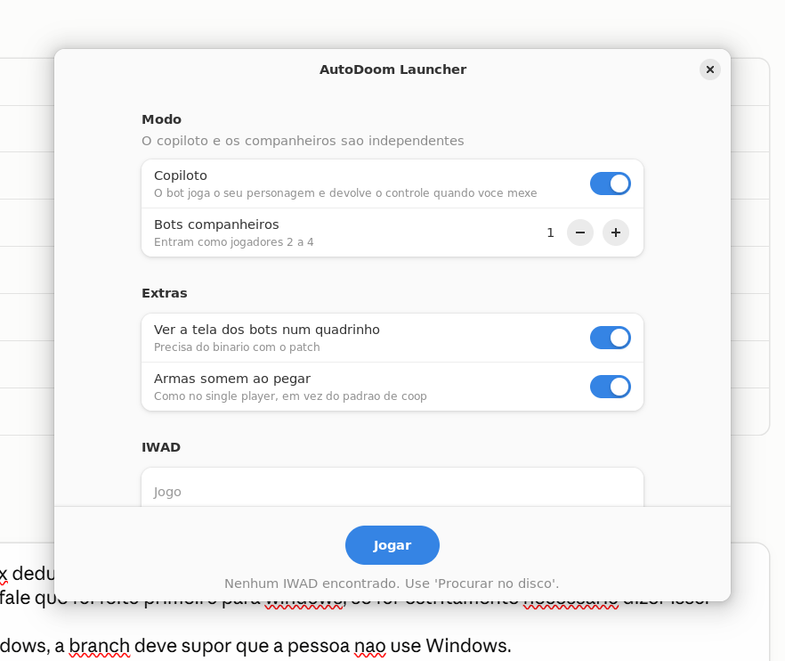

# AutoDoom Launcher para Linux — esqueleto

Python 3 + GTK 4 + libadwaita (PyGObject). Já abre, monta a linha de comando certa e sobe o
jogo; ainda não tem seletor de PWAD, ficha do IWAD com o logo lido de dentro do arquivo, nem
a varredura com barra de progresso que a versão Windows tem.



## Por que esta stack, e não outra

O alvo é **Debian e Arch**, e é isso que decide. Três candidatos reais foram pesados:

| Stack | A favor | Contra |
| --- | --- | --- |
| **Python + GTK4/libadwaita** | Está nos repositórios das duas distros (`python3-gi` / `python-gobject`), sem runtime extra para o usuário instalar. Visual nativo no GNOME e aceitável no KDE. Empacotar é um `.deb` ou `PKGBUILD` de poucas linhas, sem bundle. | Reescreve a lógica que já existia em C# — cerca de 1.100 linhas viraram ~400 em Python. |
| **Avalonia (C#/.NET)** | Reaproveitaria `IwadCatalog`, `PwadCatalog`, `GameConfig` e `WadValidator` quase intactos. | Empurra o .NET para o usuário: ou ele instala o runtime, ou o pacote carrega ~70 MB de binário self-contained. Nenhuma das duas distros empacota Avalonia. |
| **Qt6/QML** | Excelente no KDE, e Qt está em ambas as distros. | Mais cerimônia para uma janela só, e o visual destoa no GNOME, que é o padrão do Debian. |

Ganhou o **GTK4** porque o custo cai no lado certo: reescrever a lógica é trabalho meu e
acontece uma vez, enquanto exigir runtime seria custo de todo mundo que instalar, para
sempre. A lógica também é pequena de verdade — ler o cabeçalho de um WAD e o `.cfg` da engine
é meia dúzia de funções, não um domínio complicado.

## Dependências

**Debian / Ubuntu**

```
sudo apt install python3-gi python3-gi-cairo gir1.2-gtk-4.0 gir1.2-adw-1 plocate
```

**Arch**

```
sudo pacman -S --needed python-gobject gtk4 libadwaita plocate
```

Verificado na Ubuntu 24.04 com GTK 4.14, libadwaita 1.5 e PyGObject 3.48.

## Rodando

```
./autodoom-launcher [pasta-do-jogo]
```

Sem argumento ele procura, nessa ordem: o diretório atual, `~/AutoDoom` e
`~/.local/share/autodoom`.

## O que já está aqui

| Arquivo | Papel |
| --- | --- |
| `autodoom_launcher/wad.py` | Lê o diretório de lumps do WAD; reconhece IWAD e distingue Doom registrado do Ultimate pelo `E4M1` |
| `autodoom_launcher/catalog.py` | Onde procurar IWAD no Linux, mais a busca por `plocate` |
| `autodoom_launcher/game.py` | Monta `-bots`, `-copilot`, `-pip`, `-dmflags` e sobe o processo |
| `autodoom_launcher/config.py` | `settings.json` em `$XDG_CONFIG_HOME`, perfis da engine e o teclado do projeto |
| `autodoom_launcher/window.py` | A janela |
| `data/net.autodoom.launcher.desktop` | Entrada de menu |

## O que falta

- Seletor de PWAD, com a mesma validação de compatibilidade da versão Windows.
- Ficha do IWAD: logo extraído do próprio arquivo (`M_DOOM`/`TITLEPIC`), nome, tamanho, mapas.
- Bilíngue — hoje os textos estão fixos em português, direto no `window.py`.
- Empacotamento: `.deb` e `PKGBUILD`.
- Escrever `pip_follow`, pulo e fogo amigo no `eternity.cfg`; o `config.py` já tem o
  `write_cvar` pronto, falta a interface.
